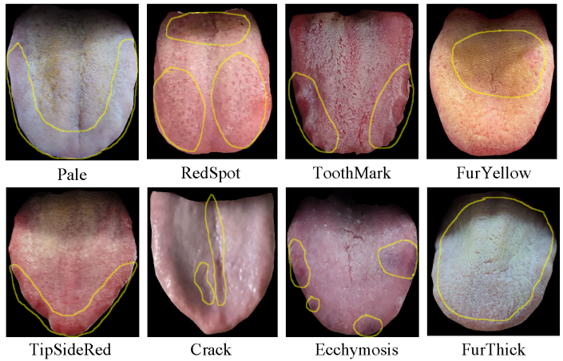

# TongueDx Dataset

## Abstract

The TongueDx dataset is a comprehensive collection of tongue images designed for telemedicine applications. It contains 5,109 images from 4,650 unique subjects, captured in diverse natural settings using various cameras, resulting in variations in environmental conditions, resolutions, and angles. The dataset defines eight key tongue attributes: Pale, TipSideRed, RedSpot, Ecchymosis, Crack, ToothMark, FurThick, and FurYellow, which are binary-classified. Each subject has one or two images taken from different distances or angles. Additionally, demographic data like age and gender are included, providing a foundation for future research.

<div align="center">

</a>
</div>

## Dataset Structure

### License
This dataset is publicly released under the Creative Commons licence CC-BY-NC-SA 4.0.

### Dataset Format

This dataset contains tongue image data with corresponding annotations. Each image is represented by the following fields:

| Field            | Description                                                                 |
|------------------|-----------------------------------------------------------------------------|
| `id`             | A unique identifier for each image. Images from the same subject taken at different time points may exist. |
| `Gender`         | The gender of the subject.                                                 |
| `Age`            | The age of the subject.                                                    |
| `TonguePale`     | Indicates whether the tongue appears pale.                                |
| `TipSideRed`     | Reflects if the tip or sides of the tongue are red.                        |
| `Spot`           | Denotes the presence of spots on the tongue.                               |
| `Ecchymosis`     | Shows whether there is ecchymosis on the tongue.                           |
| `Crack`          | Indicates if there are cracks on the tongue.                               |
| `Toothmark`      | Reflects the presence of tooth marks on the tongue.                        |
| `FurThick`       | Describes the thickness of the tongue fur.                                |
| `FurYellow`      | Indicates whether the tongue fur is yellow.                                |
| `image_path`     | The path to the tongue image file.                                         |
| `Heart`          | Annotations related to the heart, representing its more specific and complex attributes reflected through the tongue image. |
| `Lung`           | Annotations related to the lung, representing its more specific and complex attributes reflected through the tongue image. |
| `Spleen`         | Annotations related to the spleen, representing its more specific and complex attributes reflected through the tongue image. |
| `Liver`          | Annotations related to the liver, representing its more specific and complex attributes reflected through the tongue image. |
| `Kidney`         | Annotations related to the kidney, representing its more specific and complex attributes reflected through the tongue image. |

**Notes:**
- In the test set, there are some Pulse annotations, but they have been abandoned and are no longer in use.
- The Heart, Lung, Spleen, Liver, and Kidney annotations (0 indicating normal and 1 indicating abnormal) utilize a more extensive and complex set of attributes beyond the basic 8 tongue features.
- The Gender and Age labels can also be utilized if needed.
- You are welcome to utilize these extra annotations for your own research.

### Dataset Split ###
For the specific dataset split, please refer to the reference materials. Alternatively, you can use your own custom data split instead of the five-folds.


### Download Access:
To request access to the TongueDx Dataset, please fill out our [request form](https://forms.gle/GJfuYKZwjYTRUdJH6).

### Release Notes:
This is our version 1.0 release. Due to time constraints, images with later sequence IDs have been directly cropped to remove surrounding backgrounds. We are currently processing these images, and we are also extending the paper and the dataset. Detailed updates to the version 1.0 dataset and GitHub repository will continue over the coming months. Thank you for your understanding.

## Usage Restrictions
The dataset and its annotations are intended for academic research purposes only and must not be used for commercial purposes. If the dataset is used to train medical models or large language models (LLMs), the output must include a warning prompt stating that the results are generated based on experimental data and should not be used for actual medical diagnosis without further validation. Additionally, these models must be used under human supervision to ensure safety and accuracy.

## Citation

```bibtex
@article{yiliang2025, 
  title={Dr. Tongue: Sign-Oriented Multi-label Detection for Remote Tongue Diagnosis}, 
  volume={39}, 
  url={https://ojs.aaai.org/index.php/AAAI/article/view/32230}, DOI={10.1609/aaai.v39i2.32230}, 
  number={2}, 
  journal={Proceedings of the AAAI Conference on Artificial Intelligence}, 
  author={Chen, Yiliang and Ho, Steven SC and Xu, Cheng and Xie, Yao Jie and Yeung, Wing-Fai and He, Shengfeng and Qin, Jing}, 
  year={2025}, 
  month={Apr.}, 
  pages={2302-2310} 
}
```

<!--
**tonguedx/tonguedx** is a ✨ _special_ ✨ repository because its `README.md` (this file) appears on your GitHub profile.

Here are some ideas to get you started:

- 🔭 I’m currently working on ...
- 🌱 I’m currently learning ...
- 👯 I’m looking to collaborate on ...
- 🤔 I’m looking for help with ...
- 💬 Ask me about ...
- 📫 How to reach me: ...
- 😄 Pronouns: ...
- ⚡ Fun fact: ...
-->
